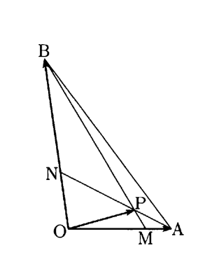

## III　問1

三角形 \(OAB\) を考える。  辺 \(OA\) を \(3:1\) に内分する点を \(M\)，  辺 \(OB\) を \(1:2\) に内分する点を \(N\) とし，  線分 \(AN\) と線分 \(BM\) の交点を \(P\) とする。

  

(1)  ベクトル \(\overrightarrow{OA},\overrightarrow{OB}\) を  それぞれ \(\vec{a},\vec{b}\) とおくとき，  ベクトル \(\overrightarrow{OP}\) を  \(\vec{a},\vec{b}\) で表すことを考える。

\[AP:PN=s:(1-s)\ \ (0<s<1)\]  

\[BP:PM=t:(1-t)\ \ (0<t<1)\]  

とおくと  

\[\overrightarrow{OP}=(\boxed{A}-s)\vec{a}+\dfrac{\boxed{B}}{\boxed{C}}s\vec{b}\]

\[=\dfrac{\boxed{D}}{\boxed{E}}t\vec{a}+(\boxed{F}-t)\vec{b}\]

が成り立つから  

\[s=\dfrac{\boxed{G}}{\boxed{H}},\  
t=\dfrac{\boxed{I}}{\boxed{J}}\] 

である。したがって，  \(\overrightarrow{OP}\) は  

\[\overrightarrow{OP}=\dfrac{\boxed{K}}{\boxed{L}}\vec{a}+\dfrac{\boxed{M}}{\boxed{N}}\vec{b}\]

と表される。

(2)  \(OA=6，OB=9\) のとき，  線分 \(OP\) の長さと  \(\angle AOB\) の大きさとの関係を調べよう。

\(OP\) の長さを \(\ell\) とおくとき，  \(\ell^2\) を  \(\vec{a}\cdot\vec{b}\) を用いて表すと  

\[\ell^2=\dfrac{\boxed{O}}{\boxed{PQ}}\vec{a}\cdot\vec{b}+\boxed{RS}\]

を得る。

したがって，  例えば \(\ell=4\) のとき  

\[\cos\angle AOB=\dfrac{\boxed{TU}}{\boxed{V}}\]

である。

一方，  \(\angle AOB\) の大きさを変えるとき，  \(\ell\) のとり得る値の範囲は  

\[\boxed{W}<\ell<\boxed{X}\]

である。
