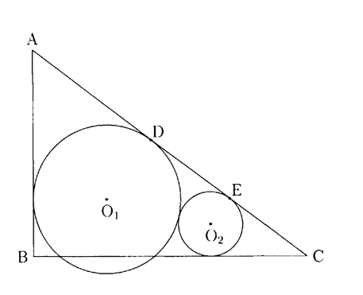

## III

右図のように  \(AB=9,\ BC=12,\ \angle ABC=90^\circ\)  を満たす三角形 \(ABC\) と，半径 \(2r\) の円 \(O_1\) と半径 \(r\) の円 \(O_2\) がある。円 \(O_1\) と円 \(O_2\) は互いに外接し，円 \(O_1\) は２辺 \(AB,\ AC\) と接し，円 \(O_2\) は２辺 \(CA,\ CB\) と接している。このとき，\(r\) の値を求めよう。

まず，２円 \(O_1,\ O_2\) と辺 \(AC\) の接点をそれぞれ \(D,\ E\) とし，\(\angle O_1AC=\alpha\) とする。

このとき，\(
\tan 2\alpha=\frac{\boxed{A}}{\boxed{B}}
\)となるから，２倍角の公式より，\(
\tan\alpha=\frac{\boxed{C}}{\boxed{D}}
\) を得る。よって，\(
AD=\boxed{E}r
\) である。

次に，\(\angle O_2CA=\beta\) とすると，\(
\alpha+\beta=\boxed{FG}^\circ
\)であるから，加法定理より，\(
\tan\beta=\frac{\boxed{H}}{\boxed{I}}
\)を得る。よって，\(
CE=\boxed{J}r
\) である。

さらに， \(
AC=\boxed{KL},\qquad
DE=\boxed{M}\sqrt{\boxed{N}}\,r
\) である。以上より，

\[
r=\frac{\boxed{OP}(\boxed{Q}-\boxed{R}\sqrt{\boxed{S}})}{41}
\]

を得る。
