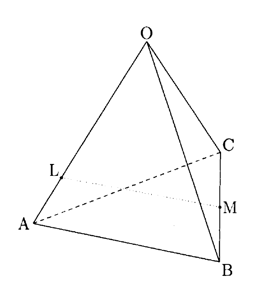

## II

1辺の長さが 1 の正四面体 \(OABC\) において，  
線分 \(OA\) を \(3:1\) に内分する点を \(L\)，線分 \(BC\) の中点を \(M\)，  
線分 \(LM\) を \(t:(1-t)\) に内分する点を \(P\) とする。ただし，\(0<t<1\) とする。

(1) \(\vec{OA}=\vec{a},\ \vec{OB}=\vec{b},\ \vec{OC}=\vec{c}\) とおき，\(\vec{OP}\) を \(\vec{a},\vec{b},\vec{c}\) で表すと  
\[
\vec{OP}=\dfrac{\boxed{A}}{\boxed{B}}(\boxed{C}-t)\vec{a}
+\dfrac{\boxed{D}}{\boxed{E}}t(\vec{b}+\vec{c})
\]
である。さらに，\(\vec{a}\cdot(\vec{b}+\vec{c})=\boxed{F},\ |\vec{b}+\vec{c}|^2=\boxed{G}\) であるから  
\[
|\vec{OP}|=\dfrac{1}{\boxed{H}}\sqrt{\boxed{I}t^2-\boxed{J}t+\boxed{K}}
\]
となる。ただし，\(\vec{a}\cdot(\vec{b}+\vec{c})\) は \(\vec{a}\) と \((\vec{b}+\vec{c})\) の内積である。

(2) \(|\vec{OP}|\) が最小となるときの \(t\) の値を求めると  
\[
t=\dfrac{\boxed{L}}{\boxed{M}}
\]
であり，その \(|\vec{OP}|\) の最小値は  \(
\dfrac{\sqrt{\boxed{N}}}{\boxed{O}}
\) である。

(3) (2) のとき，\(\cos\angle AOP=\dfrac{\boxed{P}\sqrt{\boxed{Q}}}{\boxed{R}}\) である。

注）正四面体：regular tetrahedron，内分する：divide internally，内積：inner product