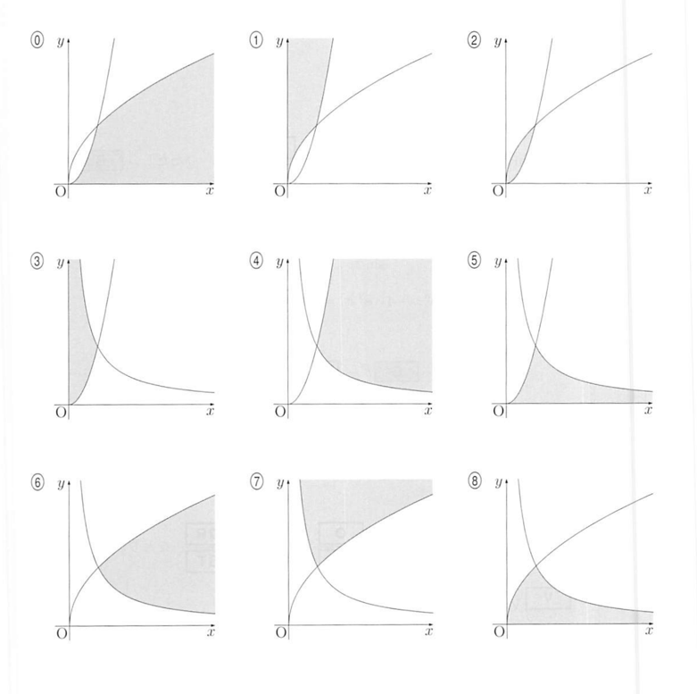

問2　\(x>0,\ y>0\) を満たす \(x,\ y\) に対して，\(\dfrac{y}{x},\ x,\ \dfrac{8}{y}\) の中で最も小さい値を \(m\) とおく。  
また，\(m=\dfrac{y}{x}\) となるような点 \((x,y)\) の集合を A，\(m=\dfrac{8}{y}\) となるような点 \((x,y)\) の集合 を B とする。

（1）次の文中の \(\boxed{M}\) 〜 \(\boxed{S}\) には，下の選択肢 ⓪〜⑦ の中から適するものを選び  
なさい。

A，B を求めると次のようになる。

\[
A=\{(x,y)\mid \boxed{M}\leqq\boxed{N},\ \boxed{O}\leqq 8\boxed{P}\}
\]
\[
B=\{(x,y)\mid 8\boxed{Q}\leqq\boxed{R},\ \ 8\leqq\boxed{S}\}
\]

⓪　\(x\)　　①　\(y\)　　②　\(x+y\)　　③　\(x-y\)  
④　\(x^2\)　　⑤　\(xy\)　　⑥　\(y^2\)　　⑦　\(x^2+y^2\)

（2）次の文中の \(\boxed{T},\ \boxed{U}\) には，右ページの選択肢 ⓪〜⑧ の中から適するものを  
選びなさい。

\(xy\) 平面上に A，B を図示すると，A は \(\boxed{T}\)，B は \(\boxed{U}\) の灰色部分である。  
ただし，座標軸は灰色部分に含まれない。

（3）点 P\((x,y)\) が \(A\cup B\) を動くとき，\(m\) の最大値を求めよう。  
P\((x,y)\in A\) のとき，\(y=mx\) であるから，原点 O と P を通る直線の傾きを最大にする  点 P を見つければよい。

また，P\((x,y)\in B\) のとき，\(m=\dfrac{8}{y}\) であるから，P の \(y\) 座標が最小になる点 P を見  つければよい。

以上より，\(m\) は \((x,y)=(\boxed{V},\boxed{W})\) のとき，最大値 \(\boxed{X}\) をとる。

【（2）の選択肢】

（注）　灰色部分：shaded portion
