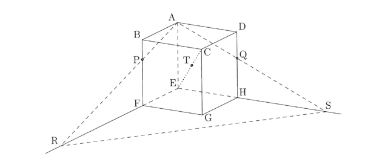

## II

**問1**　次の文中の \(\boxed{C}，\boxed{J}，\boxed{K}\) には，適する数を入れなさい。また，その他の \(\boxed{\phantom{A}}\) には，右ページの下の選択肢⓪〜⑨の中から適するものを選びなさい。

1辺の長さが1の立方体 \(ABCD\text{−}EFGH\) と，頂点 \(A\) を通り，辺 \(BF\)，\(DH\) とそれぞれ点 \(P\)，\(Q\) で交わる平面 \(\pi\) がある。線分 \(BP\)，\(DQ\) の長さを \(BP=m\)，\(DQ=n\) とする。また，平面 \(\pi\) と直線 \(EF\)，\(EH\) の交点をそれぞれ \(R\)，\(S\) とする。  
以下，ベクトル \(\overrightarrow{AB}=\vec{a}\)，\(\overrightarrow{AD}=\vec{b}\)，\(\overrightarrow{AE}=\vec{c}\) とおく。

(1)　まず，2つのベクトル \(\overrightarrow{AR}\) と \(\overrightarrow{AS}\) について，その内積 \(\overrightarrow{AR}\cdot\overrightarrow{AS}\) となす角 \(\theta\) の余弦 \(\cos\theta\) を求める。  
\(\overrightarrow{AR}\) と \(\overrightarrow{AS}\) はそれぞれ \(\vec{a}\)，\(\vec{b}\)，\(\vec{c}\) を用いて  
\[\overrightarrow{AR}=\boxed{A}\vec{a}+\vec{c}，\overrightarrow{AS}=\boxed{B}\vec{b}+\vec{c}　……①  \]
と表せる。したがって  
\[\overrightarrow{AR}\cdot\overrightarrow{AS}=\boxed{C}，\cos\theta=\dfrac{\boxed{D}}{\sqrt{\boxed{E}}}\] 
である。

(2)　線分 \(CE\) と平面 \(\pi\) との交点を \(T\) とするとき，\(\overrightarrow{CT}\) の大きさ \(|\overrightarrow{CT}|\) を求める。  
4点 \(A\)，\(R\)，\(S\)，\(T\) は平面 \(\pi\) 上にあるので，\(\overrightarrow{AT}=r\overrightarrow{AR}+s\overrightarrow{AS}\) を満たす実数 \(r\)，\(s\) が存在する。また，点 \(T\) は直線 \(CE\) 上にあるから，\(t\) を実数として \(\overrightarrow{CT}=t\overrightarrow{CE}\) とおける。このとき，①と \(\overrightarrow{CT}=\overrightarrow{CA}+\overrightarrow{AT}\) とあわせて  
\[
r=\dfrac{\boxed{F}}{\boxed{G}}\ ,\quad s=\dfrac{\boxed{H}}{\boxed{G}}\ ,\quad t=\dfrac{\boxed{I}}{\boxed{G}}
\]
が得られる。したがって  
\[
|\overrightarrow{CT}|=\sqrt{\boxed{J}}\times\dfrac{\boxed{I}}{\boxed{G}}
\]
である。

さらに，点 \(G\) が線分 \(RS\) 上にあるとするならば  
\(m+n=\boxed{K}\)，\(\overrightarrow{AG}=\boxed{L}\overrightarrow{AR}+\boxed{M}\overrightarrow{AS}\)  
が成り立つ。

⓪ \(\dfrac{1}{m}\)　　　① \(\dfrac{1}{1-m}\)　　　② \(m\)　　　③ \(m+n\)　　　④ \(m+n+1\)  
⑤ \(\dfrac{1}{n}\)　　　⑥ \(\dfrac{1}{1-n}\)　　　⑦ \(n\)　　　⑧ \(mn\)　　　⑨ \((m^2+1)(n^2+1)\)

注）　内積：inner product
