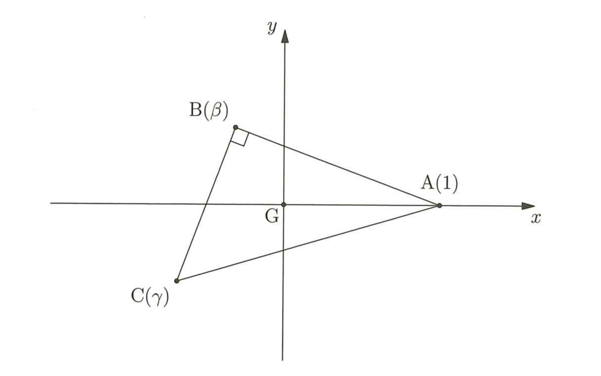

## II

**問2**　解答は，すべて各問いの下の選択肢の中から選びなさい。

\(\angle ABC=\dfrac{\pi}{2}\) となる直角三角形 \(ABC\) を考える。この三角形の重心を \(G\) とし，\(AG=1\) とする。  \(\angle BAC=\theta\) とするとき，\(\theta\) と線分 \(AG,\ BG,\ CG\) の長さとの関係について調べよう。

複素数平面上で考える。重心 \(G\) が原点と一致し，点 \(A\) を表す複素数が 1 となるようにする。  さらに，点 \(B,\ C\) を表す複素数を \(\beta,\ \gamma\) とおくとき，\(\beta\) の虚部が正となるような三角形を考える。

 

(1)　\(\angle ABC=\dfrac{\pi}{2}\) であるから

\[
\left|\dfrac{\gamma-1}{\beta-1}\right|=\boxed{N}
\]

である。したがって

\[
\dfrac{\gamma-1}{\beta-1}=\boxed{O}
\]

である。これより，\(\beta,\ \gamma\) に関する関係式 \(\boxed{P}\) を得る。

⓪　\(\dfrac{1}{\sin\theta}\)　　　　①　\(\dfrac{1}{\cos\theta}\)　　　　②　\(\dfrac{1}{\tan\theta}\)　　　　③　\(\tan\theta\)  
④　\(\tan\theta+i\)　　　　⑤　\(1+i\tan\theta\)　　　　⑥　\(1-i\tan\theta\)  
⑦　\((\tan\theta+i)\beta-\gamma-\tan\theta+1-i=0\)  
⑧　\((1+i\tan\theta)\beta-\gamma-i\tan\theta=0\)  
⑨　\((1-i\tan\theta)\beta-\gamma+i\tan\theta=0\)

(2)　以後，\(\tan\theta=t\) とおく。1，\(\beta\)，\(\gamma\) を頂点とする三角形の重心が原点と一致していることと，関係式 \(\boxed{P}\) より，\(\beta,\ \gamma\) は \(t\) を用いて

\[
\beta=\boxed{Q},\qquad \gamma=\boxed{R}
\]

と表される。したがって

\[
BG=\boxed{S},\qquad CG=\boxed{T}
\]

である。

⓪　\(-\dfrac{1+2ti}{2+ti}\) 　　 ①　\(-\dfrac{1+ti}{2-ti}\) 　　 ②　\(-\dfrac{1+ti}{1+2ti}\) 　　 ③　\(\dfrac{-1+ti}{2+ti}\)  

④　\(\dfrac{-2+ti}{1+2ti}\) 　　 ⑤　\(\dfrac{-1+2ti}{2-ti}\) 　　 ⑥　\(\sqrt{\dfrac{4+t^2}{1+t^2}}\) 　　 ⑦　\(\sqrt{\dfrac{4+t^2}{1+4t^2}}\)  

⑧　\(\sqrt{\dfrac{1+4t^2}{4+t^2}}\) 　　　 ⑨　\(\sqrt{\dfrac{1+t^2}{4+t^2}}\)

(3)　(2) で得た結果より

\[
\lim_{\theta\to+0} BG=\boxed{U},\qquad
\lim_{\theta\to+0} CG=\boxed{W},
\]

\[
\lim_{\theta\to\frac{\pi}{2}-0} BG=\boxed{V},\qquad
\lim_{\theta\to\frac{\pi}{2}-0} CG=\boxed{X}
\]

である。また，\(BG=\dfrac{2}{3}\) のとき，\(CG=\boxed{Y}\) である。

⓪　\(0\)　　　　①　\(1\)　　　　②　\(2\)　　　　③　\(3\)　　　　④　\(4\)  
⑤　\(\dfrac{1}{2}\)　　⑥　\(\dfrac{1}{4}\)　　⑦　\(\dfrac{\sqrt{10}}{3}\)　　⑧　\(\dfrac{\sqrt{11}}{3}\)　　⑨　\(\dfrac{\sqrt{13}}{3}\)

